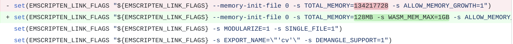

# Build OpenCV and OpenCV.js

## How to build OpenCV from source using CMake

1. `cd opencv`

2. `mkdir build && cd build`

3. `cmake -DCMAKE_BUILD_TYPE=Release -DCMAKE_INSTALL_PREFIX=/usr/local ..`

4. `make -j7 && sudo make install`

See [OpenCV build doc](https://docs.opencv.org/master/d7/d9f/tutorial_linux_install.html) for more details.


## How to build OpenCV WASM file

1. [Install and activate Emscripten](https://emscripten.org/docs/getting_started/downloads.html)

2. `cd opencv`

3. `python ./platforms/js/build_js.py build_wasm --build_wasm --emscripten_dir="/home/user/emsdk/upstream/emscripten"`

4. Optional:

    Use `--simd` and `--threads` flags for the command above if you want to optimize WASM performance by simd and threads.

    Threads optimization is based on Web Worker API and SharedArrayBuffer objects.
    For SIMD optimization, experimental WASM SIMD backend for OpenCV Universal Intrinsics was added. Please use the latest version of unstable browser (like Chrome Dev) to get improvement. Check "[Improve the performance of JavaScript version of OpenCV](https://github.com/opencv/opencv/pull/15371)" pull request to see the code, description of changes and performance analysis.

See [OpenCV.js build doc](https://docs.opencv.org/master/d4/da1/tutorial_js_setup.html) for more details.

### **modules/js/CMakeLists.txt**

`modules/js/CMakeLists.txt` is CMake file for JS support. This file gets list of OpenCV modules to wrap, passes headers with exposing functions to embindgen.py and executes this script getting bindings as a result. Moreover, it prepares Emscripten SDK (finds path and configures some flags) and WASM build directory.

### **Emscripten options**

In `opencv/modules/js/CMakeLists.txt` we can specify some Emscripten flags for building WASM.

For example, see how `-s WASM_MEM_MAX=1GB` was added to `EMSCRIPTEN_LINK_FLAGS` to prevent browser to run out of memory if used memory size grows too much:



`EMSCRIPTEN_LINK_FLAGS` then is copied to `LINK_FLAGS` property of the target being built:

```cmake
set_target_properties(${the_module} PROPERTIES LINK_FLAGS "${EMSCRIPTEN_LINK_FLAGS}")
```

#### Debugging

The _emcc_ `-g` flag can be used to preserve debug information in the compiled output.

With `EMCC_DEBUG=1` set, we can enable debug mode. _emcc_ emits debug output and generates intermediate files for the compiler’s various stages.

See more about debugging [here](https://emscripten.org/docs/porting/Debugging.html).

### **modules/js/embindgen.py**

`embindgen.py` parses headers and finds all enums, constants, global functions, classes and methods which are marked for exposing in source code and then generates bindings to `build_wasm_folder/modules/js/bindings.cpp`.

### **platforms/js/opencv_js.config.py**

`opencv_js.config.py` contains names of global functions, classes and methods that we ask to include in opencv.js.

### **platforms/js/build_js.py**

`build_js.py` configures some cmake options and builds WASM of OpenCV. For example, it can enable/disable SIMD support (`DCV_ENABLE_INTRINSICS`), threads (`DWITH_PTHREADS_PF`), DNN module (`DBUILD_opencv_dnn`) and many other features and modules.


## Optional: How to build OpenCV with opencv_contrib module

Let's see how to build WASM for example with **face** module from *opencv_contrib*.

1. Add the following flags to `def get_cmake_cmd(self)` of `opencv/platforms/js/build_js.py`:

    ```python
    "-DBUILD_opencv_face=ON",
    "-DOPENCV_EXTRA_MODULES_PATH='/home/path-to-opencv-contrib/opencv_contrib/modules'"
    ```

2. Define `face` module in `opencv/modules/js/src/embindgen.py`. Include all global functions, classes and their methods that you want to have in your wasm. For example:

    ```python
    face = {'face_FaceRecognizer': ['train', 'update', 'predict_label', 'write', 'read', 'setLabelInfo', 'getLabelInfo', 'getLabelsByString', 'getThreshold', 'setThreshold'],
            'face_BasicFaceRecognizer': ['getNumComponents', 'setNumComponents', 'getThreshold', 'setThreshold', 'getProjections', 'getLabels', 'getEigenValues', 'getEigenVectors', 'getMean', 'read', 'write'],
            'face_FisherFaceRecognizer': ['create']}
    ```

3. Add the `face` module to the `makeWhiteList` in `opencv/modules/js/src/embindgen.py`:

    ```python
    white_list = makeWhiteList([core, imgproc, objdetect, video, dnn, features2d, photo, aruco, calib3d, face])
    ```

4. Add the following in `opencv/modules/js/src/core_bindings.cpp`:

    ```cpp
    using namespace face;
    ```

5. Append `js` in `ocv_define_module` of `opencv_contrib/modules/face/CMakeLists.txt`:

    ```cmake
    ocv_define_module(face opencv_core
        opencv_imgproc
        opencv_objdetect
        opencv_calib3d   # estimateAffinePartial2D() (trainFacemark)
        opencv_photo     # seamlessClone() (face_swap sample)
        WRAP python java js
    )
    ```

6. [Build OpenCV](#How-to-build-OpenCV-from-source-using-CMake).

    Don't forget to add path to *opencv_contrib* project during cmake configuratoin:

    `cmake -DCMAKE_BUILD_TYPE=Release -DCMAKE_INSTALL_PREFIX=/usr/local -DOPENCV_EXTRA_MODULES_PATH=/home/user/opencv_contrib/modules ..`

7. [Build opencv.js WASM](#How-to-build-OpenCV-WASM-file)
